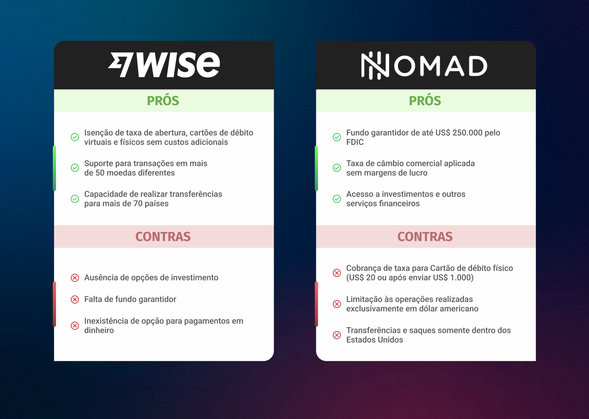

# CH2 - Development Environment
## How is Software created? | Activity 01
### Competitive Analysis of Finance Apps

**Objective:** Analyze two financial mobile applications to identify three advantages
and three disadvantages for each.

**Tasks:**

1. **Select Apps:** Choose two finance-related mobile apps.
2. **Research:** Collect data on usability, features, and user feedback.
3. **Analyze:** List three **pros** and **cons** for each app based on research.
4. **Report:** Summarize findings in a clear, concise format.
5. **Submit:** Post the report in the designated Microsoft Teams channel.

##

## Submission

Figure 1: Wise vs. Nomad Finance Apps - pt-BR version

Figure 2: Wise vs. Nomad Finance Apps - en version

##
