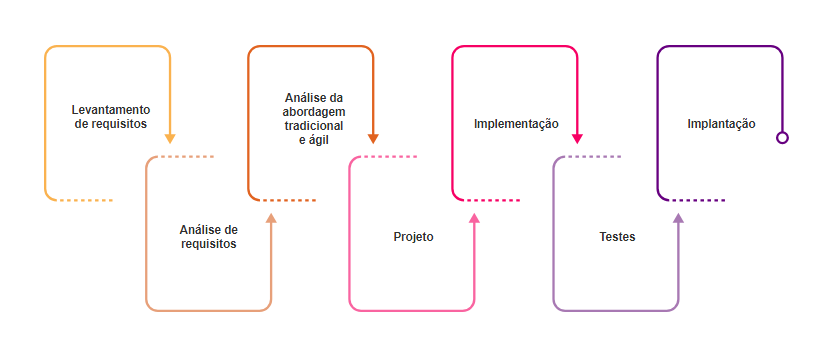

# CH2 - Development Environment
## How is Software created? | Notes
### 1.1 - Introduction

In a nutshell:

> _"Software is: **instructions** (computer programs) that when executed provide desired
**features, function,** and **performance**; **data structures** that enable the programs to
adequately manipulate information and **documentation** that describes the operation
and use of the programs."_ - Roger S. Pressman


### 1.2 - Concepts

**Software**, as already mentioned, is a collection of instructions or programs that, when
executed, inform the computer a series of actions to be performed.

**System** is a set of information and procedures that interact with each other to achieve
a specific goal.

**Software Development** refers to the process of creating, designing, implementing, and
maintaining software through a combination of activities related to computer science,
engineering, and project management.

**Engineering** represents a methodology for solving problems.

> _"Engineering is the art of construction, based on scientific and empirical knowledge. It is
> an art suitable for meeting human needs."_ - Rezende (2005, p. 1)

**Software Engineering** entails the application of engineering principles via a systematic and
disciplined approach to the development, operation, and maintenance of software aimed at
problem-solving. Software engineering solutions follow a structured set of methods, tools and
techniques for software development.

**Software Types** are classified into three main categories:

1. **System Software:** Software designed to assist in the development of other software and
computer programs using various tools and programming languages. Examples include: text
editors, compilers, interpreters, debuggers, and integrated development environments (IDEs).

 > E.g.:
   >  - Operating Systems (OS): Windows, Linux, macOS, Android, iOS, Chrome OS.
   >  - Disk Management Tools: Disk Defragmenter, Disk Cleanup, GParted, CHKDSK.
   >  - Hardware Management Programs: BIOS, UEFI, CPU-Z, MSI Afterburner.
   >  - Device Drivers: Printer, Scanner, Keyboard, Mouse, Monitor, USB Drives
   >  - Utilities: Antivirus, Firewall, File Compression, VPN, Backup.


2. **Programming Software:** Software designed to assist in the development of other software and
computer programs using various tools and programming languages. Examples include: text editors,
compilers, interpreters, debuggers, and integrated development environments (IDEs).

 > E.g.:
  >  - **Text Editors:** Sublime Text, Atom, Notepad++, Vim, Visual Studio Code (VSCode).
  >  - **Compilers:** GCC (GNU Compiler Collection), Clang, MSVC.11 (Microsoft Visual C++).
  >  - **Interpreters:** Python Interpreter (CPython), Ruby Interpreter (MRI), Node.js.
  >  - **Debuggers:** GDB (GNU Debugger), LLDB, WinDbg, PDB (Python Debugger).
  >  - **Integrated Development Environments (IDEs):** Visual Studio, Eclipse, IntelliJ IDEA, PyCharm,
      NetBeans, Android Studio, Xcode.

3. **Application Software:** Software designed to perform specific functions to meet the end-users
requirements. Examples include general-purpose software, custom software, and utility software.

 > E.g.:
  >  - **General-purpose Software:** Microsoft Office, Adobe Creative Cloud, Web browsers
      (Chrome, Firefox, Edge, Safari, Opera).
  >  - **Custom Software:** ERP (Enterprise Resource Planning) systems like SAP and Oracle ERP,
      Database applications (MySQL, PostgreSQL, MongoDB, Oracle Database), Inventory
      Management and Control Systems, among others.
  >  -  **Utility Software:** Antivirus (Kaspersky, Norton, Windows Defender), Firewall, File
    Compression Software (WinRAR, 7-Zip), Backup Software (Acronis True Image, Macrium).

Additionally, there is a possible fourth type of software, known as embedded system software:

4. **Embedded System Software:** Software designed to control machines and electronic devices
such as cars, home appliances, robots, and devices that are part of the Internet of Things
(IoT). Examples include firmware, automotive control systems, household appliance controllers,
satellite navigation systems (GPS), and many others.

##

### 2 - Hardware and Software Evolution

> _**"Hardware is what you kick; software is what you curse."**_ - Origin unknown

_Jokes aside_, in more technical terms, **Hardware** refers to any physical and electronic component
that constitutes a computer, while **Software** encompasses the logical aspect, including systems,
programs, and any operational component.

These two elements are deeply interconnected, and their individual evolution is closely linked.
Consequently, advancements in hardware accelerate the emergence and improved performance of
software, and vice versa. The synergy between hardware and software development has historically
fueled technological progress, leading to more sophisticated and efficient computing solutions.
For example, faster processors and larger memory capacities enable more complex software
applications, while innovative software can drive the demand for more powerful hardware.

Historical technological advancements have played a crucial role in shaping the current landscape
of hardware and software:

**Significant Milestones in Technological Evolution:**
<details>
    <summary><i>Click to expand</i></summary><br>

> * **17th Century:** Blaise Pascal invents a basic calculator, followed by Gottfried Wilhelm von Leibniz, who adds multiplication and division functionalities.

> * **18th Century:** Joseph-Marie Jacquard develops an automated loom controlled by punched cards, an early example of programmed instructions.

> * **1834:** Charles Babbage designs the Analytical Engine, a foundational step towards modern computing, capable of storing information.

> * **1842:** Ada Lovelace writes instructions for the Analytical Engine, becoming the first computer programmer.

> * **1847:** George Boole formulates Boolean logic, essential for the binary system in computing.

> * **1849:** The Austrian balloon, a precursor to modern drones, demonstrates early automated technology.

> * **1890:** Herman Hollerith builds the first mechanical computer, advancing data processing automation.

> * **1924:** Founding of IBM, marking a commercial leap in computer technology.

> * **1938:** Konrad Zuse creates the first electrical computer using binary theory.

> * **1943:** Alan Turing develops the first generation of modern computers using valves.

> * **1944:** Howard Aiken finishes the Mark I, the first electromechanical computer.

> * **1946:** The ENIAC, the first electronic computer, introduces significant improvements in speed and efficiency.

> * **1947:** The invention of the transistor leads to faster, more reliable machines.

> * **1957:** First transistor-based computers emerge, offering better reliability and speed.

> * **1958:** The integrated circuit (chip) facilitates the miniaturization of electronic devices, enhancing computing efficiency.
</details>

**Recent Advances in Hardware and Software Evolution:**
<details>
    <summary><i>Click to expand</i></summary><br>

> * **1969:** The ARPANET is established, leading to the development of the internet.

> * **1974:** Intel designs the 8080 microprocessor, igniting the era of microcomputers.

> * **1975:** Microsoft is founded by Americans Bill Gates and Paul Allen.

> * **1976:** The Apple I, the first commercial microcomputer, is launched by Steve Jobs and Steve Wozniak.

> * **1981:** IBM releases the Personal Computer (PC) with Microsoft's MS-DOS operating system. Military drones are used by the South African army.

> * **1983:** IBM introduces the PC-XT, featuring a hard drive.

> * **1984:** The National Science Foundation funds the Internet program, connecting government, academic, and business networks. Apple releases the Macintosh, pioneering the use of icons and a mouse.

> * **1985:** Microsoft releases Windows, achieving success with version 3.0 in 1990.

> * **1990:** Laptops and palmtops become widespread.

> * **1992:** Smartphones become essential for many. IBM launches one of the first models, the Simon.

> * **1996:** Artificial intelligence gains prominence in simulating human thought in computers. IBM's Deep Blue defeats world chess champion Garry Kasparov.

> * **End of the 20th Century:** MIT produces COG, a robot prototype with an artificial nervous system more powerful than a Macintosh, simulating human growth, thoughts, and feelings.
</details>

**Early 21st century:**
<details>
    <summary><i>Click to expand</i></summary><br>

> * **2000:** Internet browsers evolve, enabling the development of various web systems offering innovative services.

> * **2007:** The first iPhone is launched, dominating the market.

> * **2008:** HTC releases the G1 with Android. Samsung introduces the first Android phone in Brazil, the Galaxy.

> * **2012:** Singularity University students create the Matternet robot prototype for delivering medicine and food to remote areas.

> * **2013:** Amazon announces plans to use drones for delivering goods within half an hour of purchase.

> * **2016:** The World Economic Forum in Davos focuses on the Fourth Industrial Revolution, discussing digital information production/consumption and preparation for the digital era.

> * **2019:** Google achieves quantum supremacy with a quantum computer that performs calculations in minutes that would previously have taken years.
</details>

##

### 3 - Failures in Software Development

Software development is a complex process that involves multiple stages, from planning and
design to implementation and maintenance. Due to its complexity, it's susceptible to numerous
failure points, which can arise at any phase, from the initial requirements gathering to the
final software deployment.

**Common Failures in Software Development:**

1. **Requirements Failure:** Misunderstood or poorly documented requirements are leading causes of project failure. Effective requirements gathering should be comprehensive and include stakeholder engagement to ensure that the final product aligns with user needs and business goals. Failures in this area often result from:
    >  - Inadequate user input and engagement.
    >  - Ambiguous or incomplete requirements.
    >  - Lack of change management to accommodate evolving requirements.

2. **Lack of Executive Support:** Executive backing is crucial for securing necessary resources and maintaining project alignment with business strategy. Lack of support can lead to:

    >  - Insufficient funding and resources.
    >  - Misaligned project priorities.
    >  - Diminished team commitment and collaboration.

3. **Managerial Inexperience:** Ineffective project management can derail a project due to poor planning, unrealistic scheduling, and insufficient risk management. Common issues include:
    >  - Inadequate project planning and oversight.
    >  - Poor risk management strategies.
    >  - Ineffective communication and stakeholder management.

4. **Technical Challenges:** Technical issues can arise from a lack of expertise, choosing the wrong technology stack, or underestimating the complexity of the project. These challenges may lead to:
    >  - Integration problems.
    >  - Scalability issues.
    >  - Performance and reliability concerns.

5. **Resource Constraints:** Adequate resources, including time, budget, and skilled personnel, are essential for project success. Constraints in any of these areas can lead to:
    >  - Project delays and cost overruns.
    >  - Compromised product quality.
    >  - Burnout and high turnover among team members.

6. **Business and Scope Misalignment:** Ensuring that the software aligns with business goals and user needs is critical. Poor alignment can result in a product that fails to meet the intended objectives due to:
    >  - Unclear or shifting project scope.
    >  - Inadequate understanding of the market or user base.
    >  - Failure to prioritize features based on business value.

##

### 4 - Origin of Software Engineering

The term "software engineering" was coined in the 1960s and officially used in 1968 at the
NATO Software Engineering Conference. This term's origin aimed to address the _software
crisis_ by providing a systematic and controlled approach to developing complex software
systems.

Key milestones in the origin of software engineering include:

- 1960: The term "_software engineering_" emerged.
- 1968: The concept of software engineering was **formalized**.
- 1972: The NATO conference _published a report_ on software engineering.
- 1976: A commission was established to develop software engineering standards, resulting
in the IEEE 730 standard, which aimed to standardize software planning and content
preparation, completed in 1979.
- 1990: Initiation of the IEEE 1074, an international standard focusing on reconciling
software process viewpoints, which led to the creation of ISO/IEC 12207 in 1995, a
standard for software life cycle processes.

Furthermore, the Agile Manifesto was published in 2001 by Kent Beck and sixteen other
notable developers. This manifesto marked a shift towards Agile development methodologies,
focusing on principles such as customer collaboration, welcoming changes, and delivering
functional software frequently. The Agile frameworks like Extreme Programming (XP) were
developed based on these principles, emphasizing teamwork, customer involvement, and
adaptability throughout the project's life cycle.

##

### 5 - Software Engineering Knowledge Areas

The SWEBOK (_Software Engineering Body of Knowledge_), published by the IEEE Computer
Society in an attempt to **standardize knowledge** in the software engineering field,
has organized ten knowledge areas:

```plaintext
* **Software Requirements**
* **Software Design**
* **Software Construction**
* **Software Testing**
* **Software Maintenance**
* **Configuration Management and Change**
* **Software Engineering Management**
* **Software Engineering Process**
* **Software Engineering Tools and Methods**
* **Software Quality**
```

The purpose of organizing these ten knowledge areas is to **provide a comprehensive
framework** and an **outline of the topics** important for software engineering,
thereby aiding in teaching, practice, and the professional development of software
engineers.

Regardless of the knowledge area, **software engineering encompasses fundamental
elements such as methods, tools, processes, and a focus on quality**.

Other main objectives of _SWEBOK_ include:

```plaintext
1. Minimizing complexity,
2. Anticipating changes,
3. Conducting verification,
4. Defining standards for software construction.
```

##

### 6 - Software Development Life Cycle (SDLC)

In the field of software engineering, challenges encountered during development include:

```plaintext
1. Insufficient resources,
2. High costs,
3. Solutions that do not meet stakeholder expectations,
4. Software more expensive than hardware,
5. Maintenance more costly than development.
```

In light of these challenges, software engineering aims to **reduce costs**, **meet
schedules**, **improve quality**, **document appropriately**, and **adapt to necessary
changes**, satisfying customer needs and keeping pace with technological changes.

The creation of software is complex and **requires a well-defined process** to
enhance development visibility and maximize the quality of the outcomes while
minimizing time and cost wastage. According to Pressman (2009), **_all software
is built based on a lifecycle_**, composed of various stages that include methods,
tools, and procedures to create the desired product.

In software development, especially in agile environments, **constant change and
complexity are faced, necessitating project management that adapts to these conditions**.
While the traditional method focuses on sequential processes and the quality of
artifacts, **the agile method emphasizes quick adaptation to changes**, with
**customer integration and short development times**, leading to debates over the
effectiveness and application of each approach.

Both traditional and agile methodologies have their advantages and disadvantages and
are defended by their respective proponents. The Agile Manifesto highlights the
importance of flexibility, customer participation, continuous delivery, and openness
to changes at any moment of the project.

The software development process life cycle, illustrated in the attached image:

1. Begins with **Requirement Gathering**,
2. followed by **Requirement Analysis**, where traditional and agile approaches are
compared.
3. Subsequently, the **Design** is developed,
4. leading to **Implementation**.
5. After implementation, the software undergoes **Testing**, and
6. finally, **Deployment**.


Fig. 1 - Software Development Life Cycle (SDLC)

This cycle highlights the importance of continuous analysis and adaptation to
changes, reflecting the evolution of software development methods.

---
