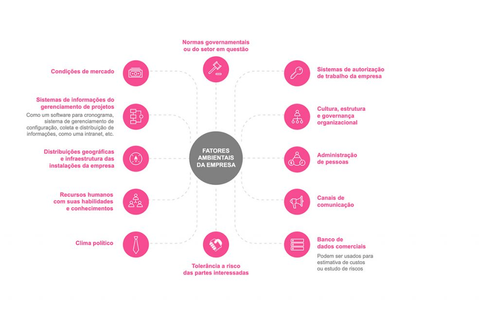

# CH3 - Development Environment
## Where do we Start? | Notes
### 1.1 - Introduction

> _"If you’re not spending at least 70% of your time working on projects, creating
 projects, or organizing your (apparently mundane) tasks into projects, you are
 sadly living in the past. Today you have to **think**, **breathe**, **act**, and
 **work** in projects."_ - Tom Peters, Fast Company, 1997-08-31.

### 1.2 - What is a project?

> _"A project is a **temporary** endeavor undertaken to create a **unique** product,
 service, or result."_ - PMI (Project Management Institute)

A project is a temporary effort aimed at creating a unique product, service, or
outcome. According to the PMBOK (Project Management Body of Knowledge), a guide to
best practices in project management, a project can be defined as having the
following characteristics:

> 1. Limited Duration;
> 2. Must be Unique;
> 3. Progressively Elaborated;
> 4. Well-defined Purpose and Objectives;
> 5. Interdependent;
> 6. Conflict;
> 7. Sequence of Activities;

##

### 1.3 - Projects vs Operations

Operations are **continuous** and **repetitive** activities, while projects are
**temporary** and **unique**. Projects are created to deliver a specific product,
service, or result, whereas operations are created to maintain a product, service,
or result.

```plaintext
E.g.:

- Project: Construction of a building;
- Operation: Maintenance of the building;
```

The project generates a unique example, usually called a prototype, while the
operation produces a series product, like an assembly line.

##

### 2 - Project Management

### 2.1 - Concepts

Stakeholders:
> _"A stakeholder is an individual, group, or organization who may affect, be affected by, or perceive itself to be affected by a decision, activity, or outcome of a project."_ - PMI

Stakeholders are all and any people who may be affected by the project, directly or indirectly. They can be internal or external to the organization, such as sponsors, clients, suppliers, developers, managers, outsourced services, etc.

Project management:
> _"Project management is the application of knowledge, skills, tools, and techniques to project activities to meet the project requirements."_ - PMI

Project management is the application of knowledge, skills, tools, and techniques to the activities of the project to meet the requirements within the deadline, according to the budget, and with the expected quality.

##

### 2.2 - Project Manager

The project manager is responsible for leading the project team, ensuring that the project is completed successfully. He is responsible for:

- Defining the project scope;
- Planning, executing, and monitoring the project;
- Developing the schedule and budget;
- Negotiating with stakeholders;
- Identifying and resolving conflicts;
- Forming and leading the project team;
- Negotiating resources;

##

### 2.3 - Company Environmental Factors

Company environmental factors are elements that influence or restrict the project, such as:

- Culture, structure, and governance of the organization;
- Geographic distributions and infrastructure of the company’s facilities.
- Government or industry standards.
- Existing human resources, with their skills and knowledge.
- Personnel administration.
- Market conditions.
- Company’s work authorization systems.
- Political climate.
- Stakeholder's risk tolerance.
- Established communication channels.
- Commercial databases that can be used for cost estimation or risk analysis.
- Project management information system: software for scheduling, configuration management system,
  information collection and distribution, such as an intranet, etc.

#### Company Environmental Factors Graph


Fig. 1 - Company Environmental Factors

##

### 3 - Modern Agile Concepts

Evolution of the Agile Manifesto, Modern Agile is a simplified and more effective approach to software development, involving practices like partial deliveries, self-organized teams, and the acceptance of changes. It is based on four principles:

1. **Make People Awesome**: The aim is to make people feel incredible so they can do incredible work.
2. **Make Safety a Prerequisite**: Safety is a priority.
3. **Experiment and Learn Rapidly**: Experiment and learn quickly, fail fast and learn fast.
4. **Deliver Value Continuously**: Deliver value continuously.

##

### 4 - Agile Software Development Methodologies

Pressman (2016) defines agile methodologies as a set of software development practices based on agile values and principles, such as continuous delivery, collaboration, communication, and adaptation to changes. He highlights three main characteristics:

1. The requirements of an agile project are unstable by nature.
2. Architecture and technical requirements are developed iteratively.
3. The project development phases are not sequential.

Thus, two techniques stand out for managing agile projects: Strategy Definition and Incremental Software Construction.

In the market, the most well-known agile methodologies are:

- **Extreme Programming (XP)**: It is an agile methodology that is based on practices such as pair programming, unit tests, and continuous integration.

- **Scrum**: It is an agile methodology based on partial deliveries and self-organization of teams.

##

### 4.1 - Project Management with Scrum


---
